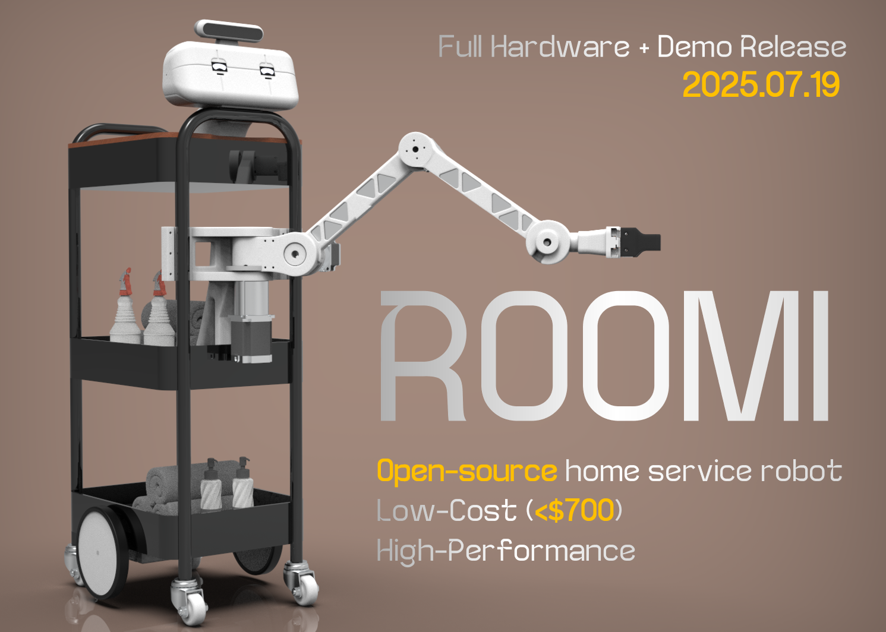

*Autonomous AI Robot for Hotels and Homes*
Apache License | [Website](https://v0-robotics-landing-page.vercel.app/) | Docs (soon)

---

🚪 **Roomi: An Affordable Autonomous Cleaning & Housekeeping Robot** 🧼

🧹 Clean. 🛏️ Make beds. 🧽 Organize.
💰 Under \~\$900. 🛠️ Assembly in \~3 hours!

> Inspired by the vision of affordable, reliable, and scalable robotics.

> Powered by: LeRobot, gym-genesis, ManiSkill.

---


📰 **Upcoming Releases**

* **2025.8.4**: Roomi support added to Genesis. Now train your Roomi policy in simulation with ease.
* **2025.7.31**: Roomi teleoperation and imitation learning suite released – collect demonstrations in real-time or from simulation!
* **2025.7.19**: Roomi v0.1 hardware – Full BOM, Demo, stl files.

---

🛒 **Cost Estimate** *(excludes shipping, tools, taxes)*

| US  $700   | EU  $600    | CN  $960   |


---

🚀 **Get Started**

Note: Wait for the full hardware release on 2025.07.19 before purchasing the items on BOM.


👣 **Steps**

1. 💵 [Buy the parts](#) — Bill of Materials (BOM)
2. 🖨️ [3D Print accessories](#) — STL files for sensor mounts & chassis
3. 🔧 [Assemble Roomi](#) — Step-by-step build guide
4. 💻 [Run the software](#) — Boot Ubuntu + ROS2 or Mujoco sim & go!

**Requirements:**

* Python 3.8+
* Platformio (for flashing firmware)
* MuJoCo (for real or sim)
* Basic Git + pip + terminal skills

Here’s the updated README section with your note added in the correct style and tone:

---

🎮 **Simulate & Teleoperate Roomi with MuJoCo**

You can launch and play (teleoperate) with Roomi using MuJoCo. We provide two entry-point scripts:

* **Basic teleop:**

  ```bash
  python roomi_mujoc.py
  ```

* **Advanced motor control:**

  ```bash
  python control.py
  ```

**Setup instructions:**

1. Create a conda environment:

   ```bash
   conda create -n roomi python=3.10
   conda activate roomi
   ```

2. Install dependencies and Roomi in editable mode:

   ```bash
   pip install -e .
   ```

---

🧠 **Roomi + ManiSkill**

Roomi is also supported in [ManiSkill](https://github.com/haosulab/ManiSkill).
Check the `roomi.py` file for how to register Roomi in simulation and define keyframes, sensors, and controllers.

---


📚 **Citation**
If referencing Roomi in research or media:

```bibtex
@misc{choghari2025roomi,
    author = {Choghari, Jade and Lee, Kyum},
    title = {Roomi: A Practical Autonomous Cleaning and Housekeeping Robot Built with Open Source Tools},
    howpublished = {\url{https://github.com/jadechoghari/roomi}},
    year = {2025},
    note = {Jade Choghari and Kyum Lee contributed equally to this work.}
}
```

---

⚠️ **Disclaimer**

By building or operating Roomi, you accept full responsibility for its behavior and outcomes. Use with care and never leave unattended in sensitive environments. This is a side project we think is cool and nice to open source!

---
